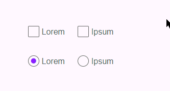

# Custom Checkbox and Radio

Sass based custom checkboxes and radios; a css-only solution.

## Install

    npm i --save custom-checkbox-radio-scss

## Include

Depending on your current directory and frontend stack, you'll want something along the lines of one of:

    @import '../node_modules/custom-checkbox-radio-scss/custom-checkbox-radio';
    @import '~custom-checkbox-radio-scss/custom-checkbox-radio'; // (webpack 3)

## Integrate

Note, your labels must proceed the inputs and all have suitable name/id/for attributes.

    <fieldset>
      <legend>Checkboxes</legend>
      

        <input type="checkbox" name="lorem-1" id="lorem-1">
        <label for="lorem-1">Lorem</label>
      

      

        <input type="checkbox" name="lorem-2" id="lorem-2">
        <label for="lorem-2">Ipsum</label>
      

    </fieldset>

    <fieldset>
      <legend>Radios</legend>
      

        <input type="radio" name="ipsum" id="ipsum-1" checked>
        <label for="ipsum-1">Lorem</label>
      

      

        <input type="radio" name="ipsum" id="ipsum-2">
        <label for="ipsum-2">Ipsum</label>
      

    </fieldset>

## Interpolate

Written in a non-invasive kinda way, so you can add your own styles to `legend`, `input[type="radio"]`, `checkbox::after`, and override the handful of default values set in [the sass file](https://github.com/entozoon/custom-checkbox-radio-scss/blob/master/custom-checkbox-radio.scss).

## Inherit

- [Font awesome](https://github.com/FortAwesome/Font-Awesome/) (CDN is fine)
